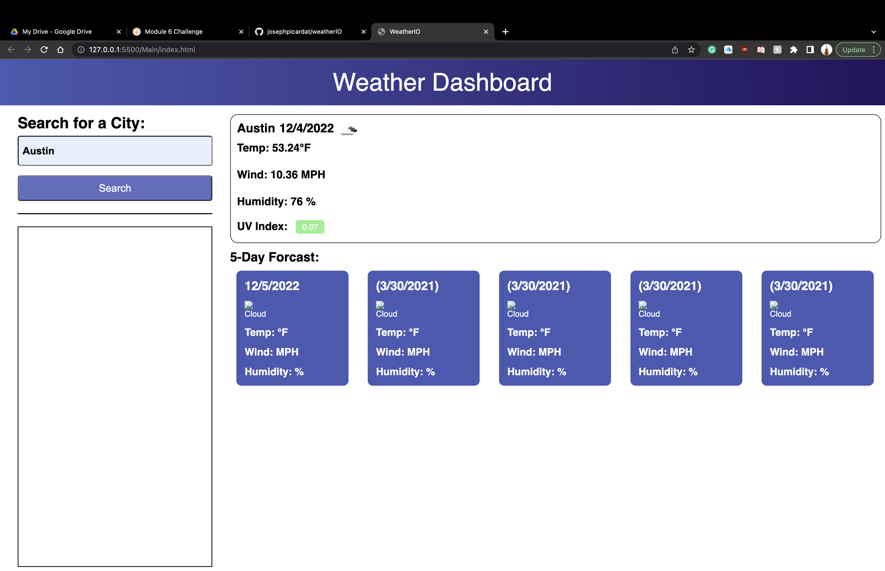

# WeatherIO

## Description

What was my motivation?

- To learn how to fetch data and use it on an application

Why did I build this project?

- To use my knowledge of html and css and fetch data from an outside source to use in my application.

What problem does it solve?

- It solved the problem of creating my own weather network.

What did I learn?

- I learned how to use data fetched from an online source to use how I want it on my own application.

## Table of Contents

- [Installation](#installation)
- [Usage](#usage)
- [Contributing](#contributing)
- [Tests](#tests)
- [Questions](#questions)
- [License](#license)

## Installation

- Step 1: Put in your api key in the javascript file
- Step 2: Right click on index.html and run live server

## Usage

## Contributing

No collaborators

## Tests

No Tests

## Questions

Github Profile: josephpicardat

If you need to reach me, you can with through my email: josephpicardat1@gmail.com

## License

(https://opensource.org/licenses/MIT)

Copyright 2022 Joseph Picardat

Permission is hereby granted, free of charge, to any person obtaining a copy of this software and associated documentation files (the "Software"), to deal in the Software without restriction, including without limitation the rights to use, copy, modify, merge, publish, distribute, sublicense, and/or sell copies of the Software, and to permit persons to whom the Software is furnished to do so, subject to the following conditions:

    The above copyright notice and this permission notice shall be included in all copies or substantial portions of the Software.

    THE SOFTWARE IS PROVIDED "AS IS", WITHOUT WARRANTY OF ANY KIND, EXPRESS OR IMPLIED, INCLUDING BUT NOT LIMITED TO THE WARRANTIES OF MERCHANTABILITY, FITNESS FOR A PARTICULAR PURPOSE AND NONINFRINGEMENT. IN NO EVENT SHALL THE AUTHORS OR COPYRIGHT HOLDERS BE LIABLE FOR ANY CLAIM, DAMAGES OR OTHER LIABILITY, WHETHER IN AN ACTION OF CONTRACT, TORT OR OTHERWISE, ARISING FROM, OUT OF OR IN CONNECTION WITH THE SOFTWARE OR THE USE OR OTHER DEALINGS IN THE SOFTWARE.
